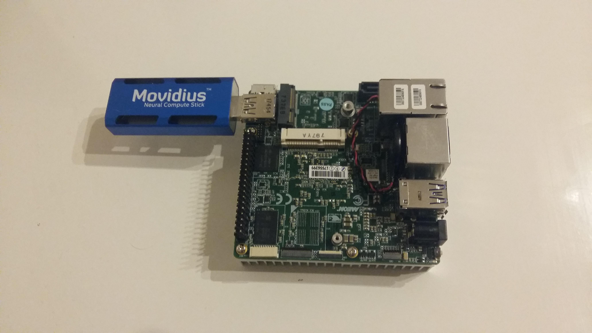
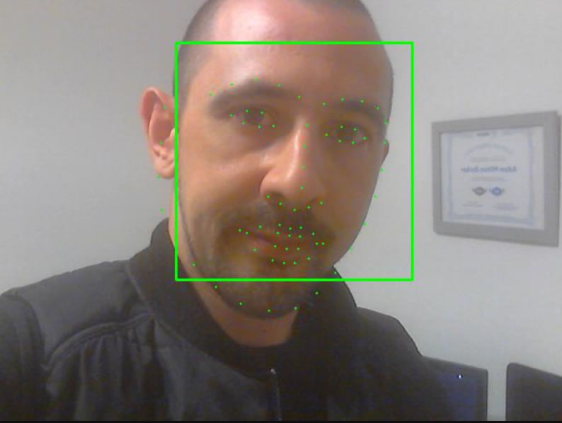

# TASS Movidius Facenet Classifier

[](https://github.com/iotJumpway/TASS-AI/tree/master/Facenet)

The **TASS Movidius Facenet Classifier** uses Siamese Neural Networks and Triplet Loss to classify known and unknown faces, basically this means it calculates the distance between an image it is presented and a folder of known faces. 

The project uses an **UP2 (Up Squared)** (A regular Linux desktop or Raspberry 3 and above will also work) the **Intel Movidius** for inference and the [iotJumpWay](https://www.iotjumpway.tech "iotJumpWay") for IoT connectivity. 



With previous versions of TASS built using Tensorflow, **TASS Movidius Inception V3 Classifier**, the model had issues with the [Openset Recognition Issue](https://www.wjscheirer.com/projects/openset-recognition/ "Openset Recognition Issue"). **TASS Movidius Facenet Classifier** uses a directory of known images and when presented with a new image, will loop through each image basically measuring the distance between the known image and the presented image, it seems to overcome the issue so far in small testing environments of one or more people. In a large scenario this method will not be scalable, but is fine for small home projects etc. 

Combining **TASS Movidius Inception V3 Classifier** (prone to open set recognition issues) and **TASS Movidius Facenet Classifier** will allow us to catch false positives and verify positive classifications using the name/ID of that prediction to quickly index into the images and make a single calculation to determine if Inception classified the person correctly or not using Facenet and making the project more scalable. The latest Inception version of the classifier will be uploaded to this repository soon.

## What Will We Do?

1. Install the [Intel® NCSDK](https://github.com/movidius/ncsdk "Intel® NCSDK") on a Linux development device.
2. Clone & set up the repo.
3. Install and download all requirements.
4. Prepare your known and testing faces datasets.
5. Test the **TASS Movidius Facenet Classifier** on the testing dataset.
6. Run **TASS Movidius Facenet Classifier** on a live webcam
7. Install the [Intel® NCSDK API](https://github.com/movidius/ncsdk "Intel® NCSDK API") on a Raspberry Pi 3 / UP 2.
8. Upload and run the program on an **UP2** or **Raspberry Pi 3**

## Python Versions

- Tested in Python 3.5

## Software Requirements

- [Intel® NCSDK](https://github.com/movidius/ncsdk "Intel® NCSDK")
- [Tensorflow 1.4.0](https://www.tensorflow.org/install "Tensorflow 1.4.0")
- [iotJumpWay MQTT Client](https://github.com/iotJumpway/JumpWayMQTT "iotJumpWay MQTT Client")
- [GrovePi](https://github.com/DexterInd/GrovePi "GrovePi") (OPTIONAL)

## Hardware Requirements

- 1 x [Intel® Movidius](https://www.movidius.com/ "Intel® Movidius")
- 1 x Linux Desktop for Movidius development (Full SDK)
- 1 x Raspberry Pi 3 / UP Squared for the classifier / webcam

## Optional Hardware Requirements

- 1 x Raspberry Pi 3 for IoT connected alarm
- 1 x Grove starter kit for IoT, Raspberry Pi edition
- 1 x Blue LED (Grove)
- 1 x Red LED (Grove)
- 1 x Buzzer (Grove)

## Install NCSDK On Your Development Device

The first thing you will need to do is to install the **NCSDK** on your development device.

```
 $ mkdir -p ~/workspace
 $ cd ~/workspace
 $ git clone https://github.com/movidius/ncsdk.git
 $ cd ~/workspace/ncsdk
 $ make install
```

Next plug your Movidius into your device and issue the following commands:

```
 $ cd ~/workspace/ncsdk
 $ make examples
```

## Cloning The Repo

You will need to clone this repository to a location on your development terminal. Navigate to the directory you would like to download it to and issue the following commands.

    $ git clone https://github.com/AdamMiltonBarker/TASS-AI.git

Once you have the repo, you will need to find the files in this folder located in [TASS-AI/Facenet](https://github.com/AdamMiltonBarker/TASS-AI/tree/master/Facenet "TASS-AI/Facenet").

## Setup

Now you need to setup the software required for the classifier to run. The setup.sh script is a shell script that you can run on both your development device and Raspberry Pi 3 / UP Squared device. 

Make sure you have installed the **NCSDK** on your developement machine, the following command assumes you are located in the [TASS-AI/Facenet](https://github.com/AdamMiltonBarker/TASS-AI/tree/master/Facenet "TASS-AI/Facenet") directory.

The setup.sh file is an executable shell script that will do the following:

- Install the required packages named in **requirements.txt**
- Downloads the pretrained Facenet model (**davidsandberg/facenet**)
- Downloads the pretrained **Inception V3** model
- Converts the **Facenet** model to a model that is compatible with the **Intel® Movidius**

To execute the script, enter the following command:

```
 $ sh setup.sh
```

If you have problems running the above program and have errors try run the following command before executing the shell script. You may be getting errors due to the shell script having been edited on Windows, the following command will clean the setup file.

```
 $ sed -i 's/\r//' setup.sh
 $ sh setup.sh
```

## Preparing Your Dataset

You need to set up two very small datasets. As we are using a pretrained Facenet model there is no training to do in this tutorial and we only need one image per known person. You should see the **known** and **testing** folders in the **data** directory, this is where you will store 1 image of each person you want to be identified by the network, and also a testing dataset that can include either known or unknown faces for testing. When you store the known data, you should name each image with the name you want them to be identified as in the system, in my testing I used images of me and two other random people, the 1 image used to represent myself in the known folder was named Adam  

## Test the TASS Movidius Facenet Classifier

Now it is time to test out your classifier, on your development machine in the [TASS-AI/Facenet](https://github.com/AdamMiltonBarker/TASS-AI/tree/master/Facenet "TASS-AI/Facenet") directory:

```
 $ python3.5 Classifier.py
```
This will run the classifier test program, the program will first loop through your testing images, and once it sees a face it will loop through all of the known faces and match them against the faces, once it finds a match, or not, it will move on to the next image in your testing loop until all images have been classifier as known or unknown. 

```
-- Total Difference is: 1.7931939363479614
-- NO MATCH
-- Total Difference is: 0.8448524475097656
-- MATCH Adam-2.jpg
```

## Run **TASS Movidius Facenet Classifier** on a live webcam

Now comes the good part, realtime facial recognition and identification. 



**WebCam.py** should connect to the local webcam on your device, process the frames and send them to a local server that is started by this same program. Be sure to edit the **ID** and **Name** values of the **Cameras** section of **required/confs.json** section using the details provided when setting up the configs, and add the URL of the IP of your device ie: http://192.168.1.200 to the **Stream** value and you can change **StreamPort** to whatever you want. These two fields will determine the address that you access your camera on, using the previous IP (Stream) and the StreamPort as 8080 the address would be **http://192.168.1.200:8080/index.html**.

```
"Cameras": [
{
    "ID": 0,
    "URL": 0,
    "Name": "",
    "Stream": "",
    "StreamPort": 8080
}
```

The program uses a **dlib** model to recognize faces in the frames / mark the facial points on the frame, and **Facenet** to determine whether they are a known person or not. Below are the outputs around the time that the above photo was taken. You will see that the program publishes to the **Warnings** channel of the IoT JumpWay, this is currently the name for the channel that handles device to device communication via rules.

```
-- Saved frame
-- Total Difference is: 1.0537698864936829
-- MATCH
-- Published: 30
-- Published to Device Warnings Channel
```

**Acknowledgement:** Uses code from Intel® **movidius/ncsdk** ([movidius/ncsdk Github](https://github.com/movidius/ncsdk "movidius/ncsdk Github"))<br />
**Acknowledgement:** Uses code from Intel® **davidsandberg/facenet** ([davidsandberg/facenet Github](https://github.com/davidsandberg/facenet "davidsandberg/facenet"))

## Bugs/Issues

Please feel free to create issues for bugs and general issues you come across whilst using this or any any related iotJumpWay issues.

## Contributors

[](https://github.com/AdamMiltonBarker)


